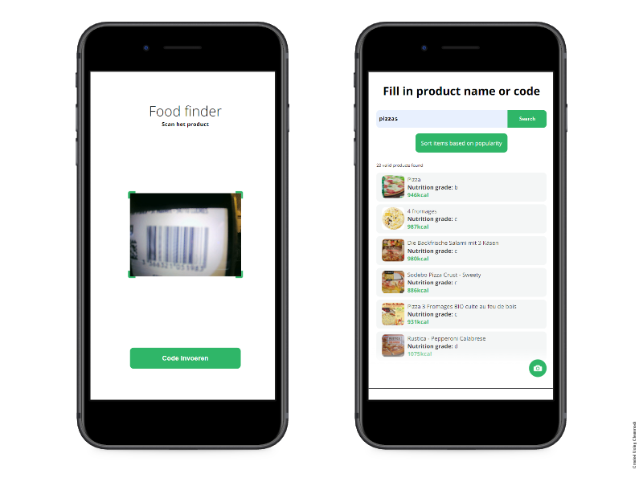
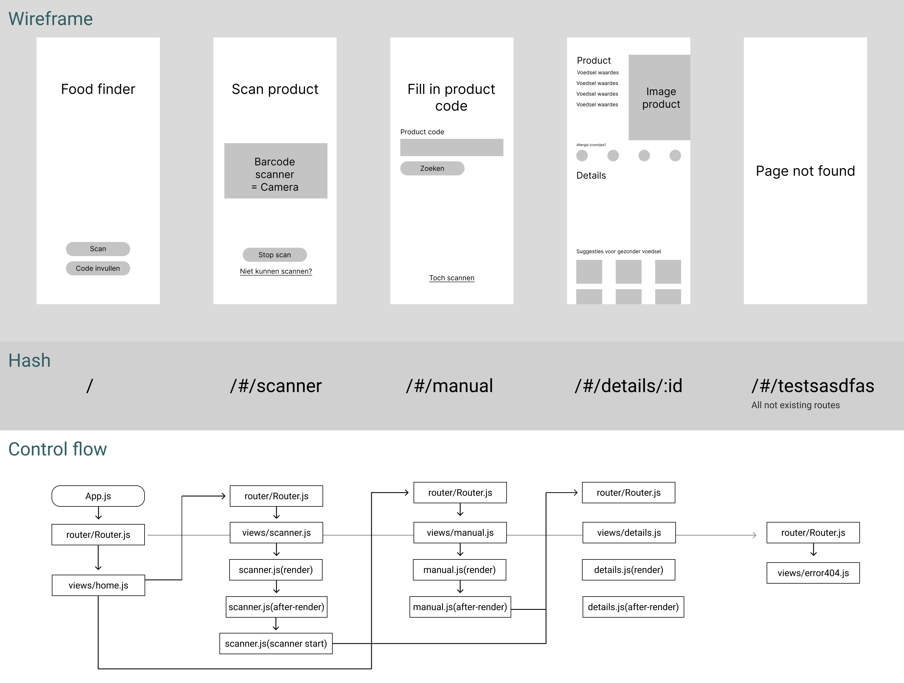

# ⚙ Food finder

<br><br>
[Link to live product](https://koenhaagsma.github.io/Food-Finder/index.html)


## 📂 Assignment
De assignment is build a SPA with vanilla JS (and microlibraries if needed) based on a user story that you chose yourself:
'As a foodie, I want to be able to easily search and view information about a product while shopping, so that I can make a good choice whether it fits my diet. Healthy Food Checker - Open Food Facts API'

## 🧾 Table of contents
-   [About the project](##About-the-project)
-   [Iterations](##Iterations)
      * [Built with](##Built-with)
-   [Getting started](##Getting-started)
      * [Installation](##Installation)
-   [Packages/Dependecies](##Packages/dependecies)
      * [Dependecies](##Dependecies)
      * [Dev dependecies](##Dev-dependecies)
-   [License](##License)

## 📖 About the project
My project is about a user story that i chose to do: 'As a foodie, I want to be able to easily search and view information about a product while shopping, so that I can make a good choice whether it fits my diet. Healthy Food Checker - Open Food Facts API', so i build a web app where it is really fast to look if a product is healthy or not.
My first priority is: How can the user look if a product is healthy as fast as possible.

### 🛠 Built with
The project is built with Vanilla JS, HTML and CSS, there is some help from microlibraries like Quagga.js because my Windows computer doesn't support the native barcode scanner in JS yet.

## 🔁 Iterations
See wiki for iterations and more in depth info<br>
<a href="">Wiki</a>

## 🎱 Activity Diagram
Activity diagram: <br>


## 🔍 Getting started
*Before you can start you need to follow the installation*

## 🔨 Installation
1. Open the terminal, or use the terminal in your IDE

2. Clone the repository
```
git clone https://github.com/KoenHaagsma/Food-Finder.git
```
3. Go to the cloned repository
```
cd ../../Food-Finder
```
4. Start application with Live-Server in VSCODE
```
Right bottom: 'Go live'
```

## 🧰 Packages/dependecies

### 🧱 Dependecies/Packages
- [Quagga.js](https://serratus.github.io/quaggaJS/)

## 📑 Sources
- [Quagga.js](https://serratus.github.io/quaggaJS/)
- [Hash router](https://github.com/rishavs/vanillajs-spa)

## 🔖 License
[]()

## 👪 Contributers
*Insert contributers and their role*
